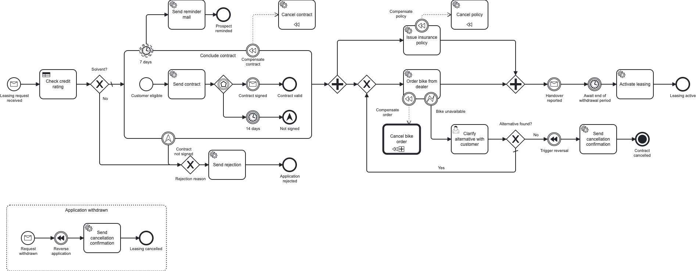

# Operaton Remote Bike-Leasing Blueprint

> [!NOTE]
> **🚧 Work in progress.** A **solution template** to fork and build on — not a product that ships.
> Expect it to keep evolving.

A ready-to-fork **starting point** for automating a business process on
[Operaton](https://operaton.org) (the community fork of Camunda 7) with a **remote engine** and
Spring Boot. The engine runs as a generic host, while a separate worker **owns the process** — it
deploys the model into the engine and runs all service-task logic as **external tasks** over the
engine's REST API.

<!-- variant:blueprint -->
## 🧭 Pick your stack

| | [`kotlin-gradle/`](kotlin-gradle/README.md) | [`java-maven/`](java-maven/README.md) |
|---|---|---|
| **Stack** | Kotlin 2.4 · Gradle | Java 21 · Maven |
| **Choose it when** | you are free to choose — **our recommendation for a modern stack** | Java + Maven is your team's or company's standard, or you are in a training |

Both run the same process, expose the same REST contract and pass the same end-to-end scenarios. Each
directory is self-contained — build, code, process models and schema — and CI keeps the models and
configuration of the two identical, so only the language and the build tool differ. Building on one?
[Turn the repo into a single-stack starter](docs/starter.md) with one command.
<!-- /variant:blueprint -->

## 🚲 The scenario

**MiraVelo** is a (fictional) bike brand that sells on a **leasing model**. This project automates a
leasing application from the first request to an active lease — and deliberately walks through the
**broad palette of BPMN elements you meet in real processes**, not just a happy-path service task:



- **message start event**, **service tasks** (run as external tasks by the worker) and a **DMN business-rule task**
- **embedded sub-process** with an **event-based gateway** and a non-interrupting **reminder timer**
- **parallel fork/join**, and a **user task with a Camunda Form** — completable in the Tasklist or via REST
- **execution** and **task listeners**, which (unlike the service tasks) run **inside the engine**
- **compensation / SAGA** handlers guarded by **error** and **escalation** boundary events
- **call activity**, **message event sub-process** (withdrawal) and a **terminate end event**

## 🚀 Run it

You need **JDK 21** and **Docker** (or Podman). The topology is three processes — Postgres, the engine
host, the worker — and the worker deploys its process into the engine at start-up, so start them in
this order.

**1. Start Postgres**

```bash
docker compose -f stack/docker-compose.yml up -d
```

**2. Start the engine host** on :8081

<!-- variant:kotlin-gradle -->
```bash
cd kotlin-gradle && ./gradlew :service:engine-service:bootRun
```
<!-- /variant:kotlin-gradle -->
<!-- variant:blueprint -->
or
<!-- /variant:blueprint -->
<!-- variant:java-maven -->
```bash
cd java-maven && ./mvnw -DskipTests install && ./mvnw -pl service/engine-service spring-boot:run
```
<!-- /variant:java-maven -->

**3. Start the worker** on :8082, in a second shell

<!-- variant:kotlin-gradle -->
```bash
cd kotlin-gradle && ./gradlew :service:example-service:bootRun
```
<!-- /variant:kotlin-gradle -->
<!-- variant:blueprint -->
or
<!-- /variant:blueprint -->
<!-- variant:java-maven -->
```bash
cd java-maven && ./mvnw -pl service/example-service spring-boot:run
```
<!-- /variant:java-maven -->

**4. Use it** — open the Cockpit / Tasklist at <http://localhost:8081/operaton> (admin/admin) or the
Swagger UI at <http://localhost:8082/swagger-ui.html>, or drive the whole process over REST:

```bash
cd bruno && npx --yes @usebruno/cli@4.0.0 run . --env local -r
```

## 📂 What's where

<!-- variant:kotlin-gradle variant:nested -->
- [`kotlin-gradle/`](kotlin-gradle/README.md) — both apps in Kotlin + Gradle, the build and its quality gates
  <!-- /variant:kotlin-gradle -->
  <!-- variant:java-maven variant:nested -->
- [`java-maven/`](java-maven/README.md) — both apps in Java 21 + Maven, the build and its quality gates
  <!-- /variant:java-maven -->
- [`openapi/`](openapi/openapi.json) — the checked-in, drift-gated OpenAPI contract of the worker
- [`bruno/`](bruno/README.md) — the REST scenarios, the two ways to complete a user task, the incident demo
- [`stack/`](stack/docker-compose.yml) — the Postgres dev stack
- [`docs/`](docs/README.md) — the Architecture Decision Records: why the repo is shaped this way
- [`CONTRIBUTING.md`](CONTRIBUTING.md) — setup, ports, containers and the PR workflow

## 🤝 Contributing

Contributions are welcome. Open an issue before a substantial change, keep the CI gates green and use
[Conventional Commits](https://www.conventionalcommits.org). The details are in
[`CONTRIBUTING.md`](CONTRIBUTING.md).

## 📄 License

Licensed under the [MIT License](./LICENSE).
